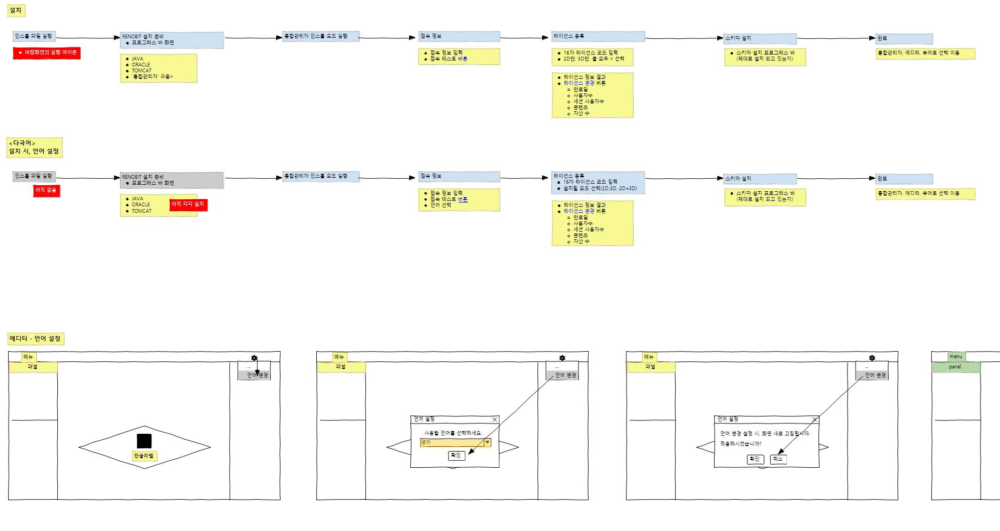

<button>test</button>

각주 참조 전의 문자열.[^2]김석환 ㅇ리이러ㅘㅈ동라머ㅣㅇㄹ [^1]

[^1]: 각주에 포함되는 언급.
[^2]: 각주에 포함되는 언급.
[^3]: 각주에 포함되는 언급.

마크다운 문법의 `문자열`을 HTML 로 변환하기 위해
`gitbook` 을 사용하세요.

그림: 

내 이름은 {{ file.path }} 입니다, 만나서 반갑습니다

#마크다운 문자열

#AsciiDoc 문자열

| One    | Two | Three | Four    | Five  | Six 
| --- | --- | --- | --- | --- | --- |
| Span <td colspan=3>triple  <td colspan=2>double