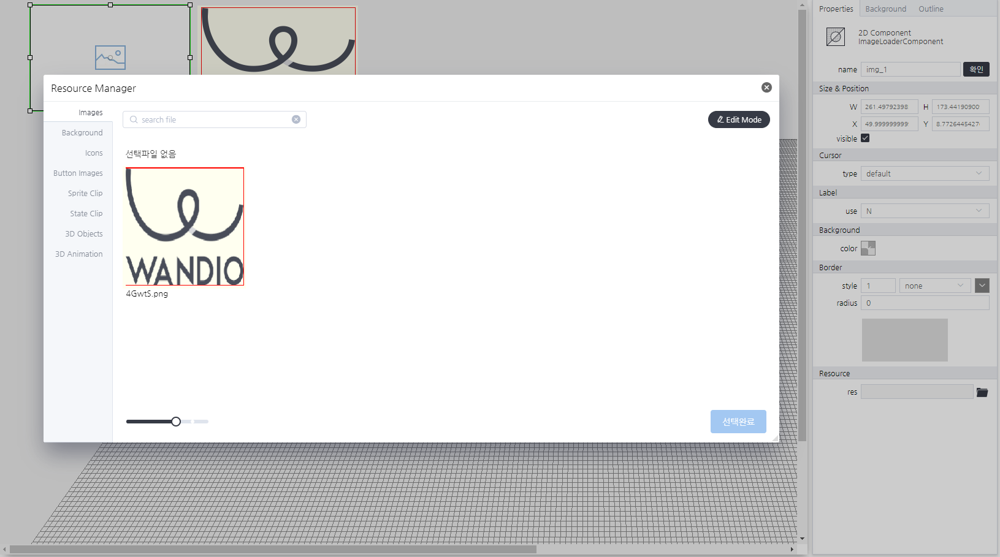

# ImageLoaderComponent
> 리소스매니저를 이용하여 이미지를 나타내는 컴포넌트 입니다.

#### Properties

ImageLoaderComponent는 속성을 제공하지 않습니다.

#### Methods

ImageLoaderComponent는 함수를 제공하지 않습니다.

#### Events
|이벤트명|이벤트 인자|설명|
|---|---|---|
|click||마우스 클릭시 발생|
|dblclick||마우스 더블 클릭시 발생|
|register||화면에 등록시 발생|
|completed||리소스 로드 완료시 발생|
|destroy||컴포넌트 삭제시 발생|

#### How to use

ImageLoaderComponent은 컴포넌트의 기본 사용법만 제공합니다.

---

이미지 로더 설정 화면
