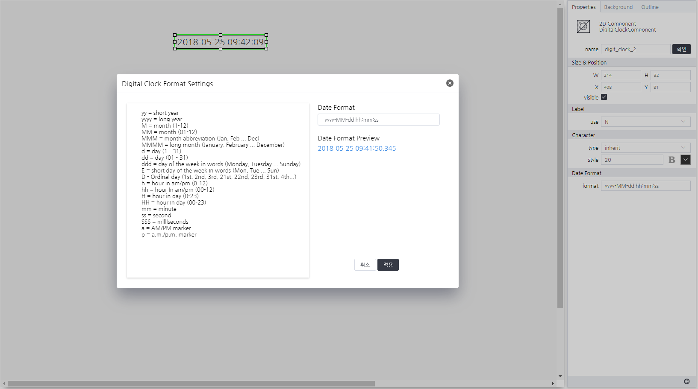

# DigitalClockComponent
> 서버 시간 기준으로 시간을 설정하는 컴포넌트입니다.

#### Properties
| Name       | Type    | Desc                                                |
| :--------- | :------ | :-------------------------------------------------- |
| dateFormat | String  | 시간 포맷 정보                                  |

#### Methods

DigitalClockComponent는 함수를 제공하지 않습니다.

#### Events
|이벤트명|이벤트 인자|설명|
|---|---|---|
|click||마우스 클릭시 발생|
|dblclick||마우스 더블 클릭시 발생|
|register||화면에 등록시 발생|
|completed||리소스 로드 완료시 발생|
|destroy||컴포넌트 삭제시 발생|

#### How to use
```js
// 해당 컴포넌트의 속성을 변경하는 방법 01.
this.text = "yyyy-MM-dd HH:mm:ss";
// 해당 컴포넌트의 속성을 변경하는 방법 02.
this.setGroupPropertyValue("setter","dateFormat", "yyyy-MM-dd HH:mm:ss")
```

---


<p align="right" style="margin-top: -.85em;font-style: italic;">디지털 시계 설정 화면</p>