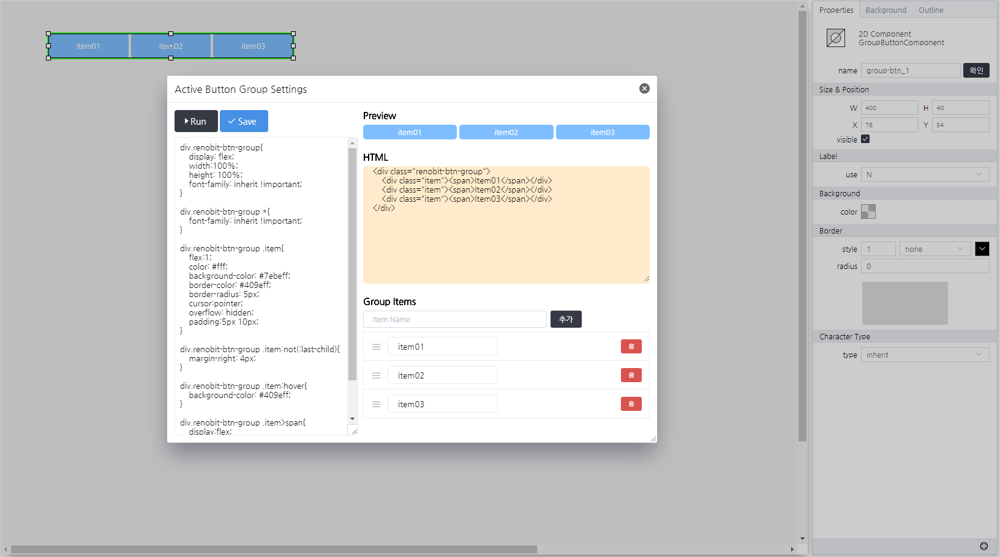

# GroupButtonComponent
> HTML, CSS를 구성하여 사용할 수 있는 그룹 버튼 컴포넌트입니다.

#### Properties
| Name       | Type    | Desc                                                |
| :--------- | :------ | :-------------------------------------------------- |
| items | Array<`String`>  | item의 label 배열                             |

#### Methods

GroupButtonComponent는 함수를 제공하지 않습니다.

#### Events
|이벤트명|이벤트 인자|설명|
|---|---|---|
|click||마우스 클릭시 발생|
|dblclick||마우스 더블 클릭시 발생|
|register||화면에 등록시 발생|
|completed||리소스 로드 완료시 발생|
|destroy||컴포넌트 삭제시 발생|
|change|index|값을 선택시 발생|

#### How to use

```js
var list = ["item01", "item02", "item03"];

// 해당 컴포넌트의 속성을 변경하는 방법 01
this.items = list;
// 해당 컴포넌트의 속성을 변경하는 방법 02.
this.setGroupPropertyValue("setter","items", list);
// 이벤트 인자 확인 방법
console.log(event.data.index);
// 결과값(샘플) > 1
```

---


<p align="right" style="margin-top: -.85em;font-style: italic;">버튼 리스트 구성 및 미리보기</p>