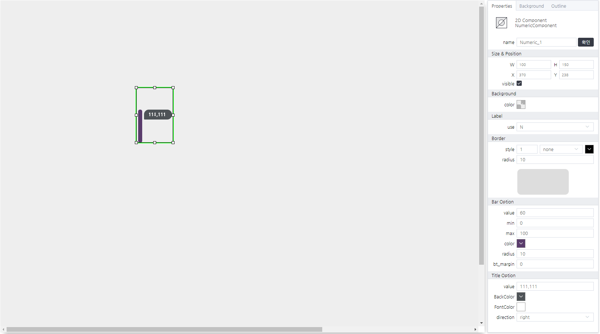

# numericComponent
> 기본으로 제공하는 progressBar Custom 컴포넌트입니다.

#### Properties
| Name       | Type    | Desc                                                |
| :--------- | :------ | :-------------------------------------------------- |
| bar_value | Number  | Bar Value 정보                                        |
| min_value | Number  | Bar Value 범위의 최솟값                                |
| max_value | Number  | Bar Value 범위의 최댓값                                |
| bt_margin | Number  | Bar Value 범위의 예외값 (기준 : bottom )                |
| bar_color | String  | Bar 의 색상 값                                         |
| bar_radius | String  | Bar 의 Radius 값                                      |
| direction | String  | 툴팁의 방향 ( left, right )                            |
| text_value | String  | 툴팁 text 정보                                         |
| title_BackColor | String  | 툴팁 배경 색상 값                                  |
| title_FontColor | String  | 툴팁 폰트 색상 값                                  |

#### Methods

NumericComponent는 함수를 제공하지 않습니다.

#### Events
|이벤트명|이벤트 인자|설명|
|---|---|---|
|click||마우스 클릭시 발생|
|dblclick||마우스 더블 클릭시 발생|
|register||화면에 등록시 발생|
|completed||리소스 로드 완료시 발생|
|destroy||컴포넌트 삭제시 발생|
|change|value|값을 선택시 발생|

#### How to use
```js
// 해당 컴포넌트의 속성을 변경하는 방법 01.
this.text_value = "11.1%";
this.bar_value = 60;
// 해당 컴포넌트의 속성을 변경하는 방법 02.
this.setGroupPropertyValue("setter","text_value", "11.1%")
this.setGroupPropertyValue("setter","bar_value", "60")

// 이벤트 인자 확인 방법
console.log(event.data.value);
// 결과값(샘플) > [{ "bar_value" : 60, "value": "11%" }]
```

#### Example


<p align="right" style="margin-top: -.85em;font-style: italic;">Numeric 프로퍼티 설정 및 에디터 화면</p>