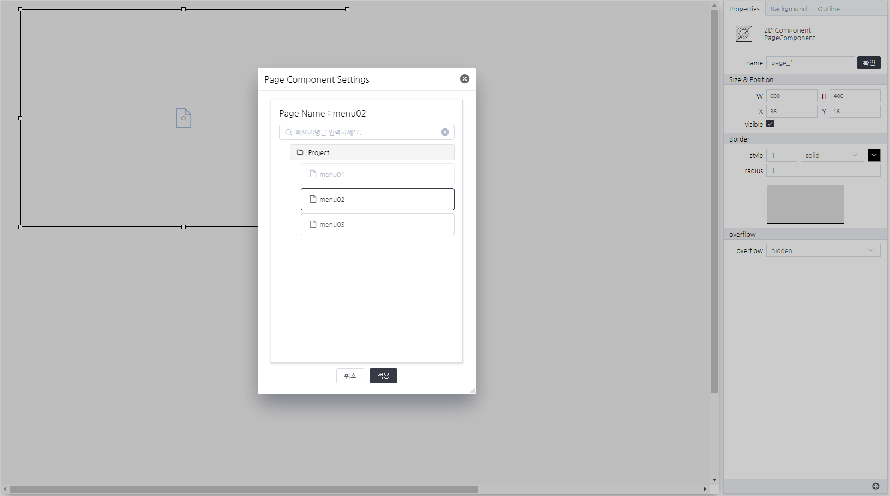

# PageComponent
> 구성한 페이지를 컴포넌트안에 삽입하여 사용하는 컴포넌트입니다.

#### Properties
| Name       | Type    | Desc                                                |
| :--------- | :------ | :-------------------------------------------------- |
| pageName | String  | pageName 정보                                        |
| usingPopupPage | Boolean  | 팝업 페이지 사용 유무                             |
| overflow | String  | overflow 여부                             |

#### Methods

PageComponent는 함수를 제공하지 않습니다.

#### Events
|이벤트명|이벤트 인자|설명|
|---|---|---|
|click||마우스 클릭시 발생|
|dblclick||마우스 더블 클릭시 발생|
|register||화면에 등록시 발생|
|completed||리소스 로드 완료시 발생|
|destroy||컴포넌트 삭제시 발생|

#### How to use

PageComponent은 컴포넌트의 기본 사용법만 제공합니다.

#### Example

단일 페이지 설정화면
