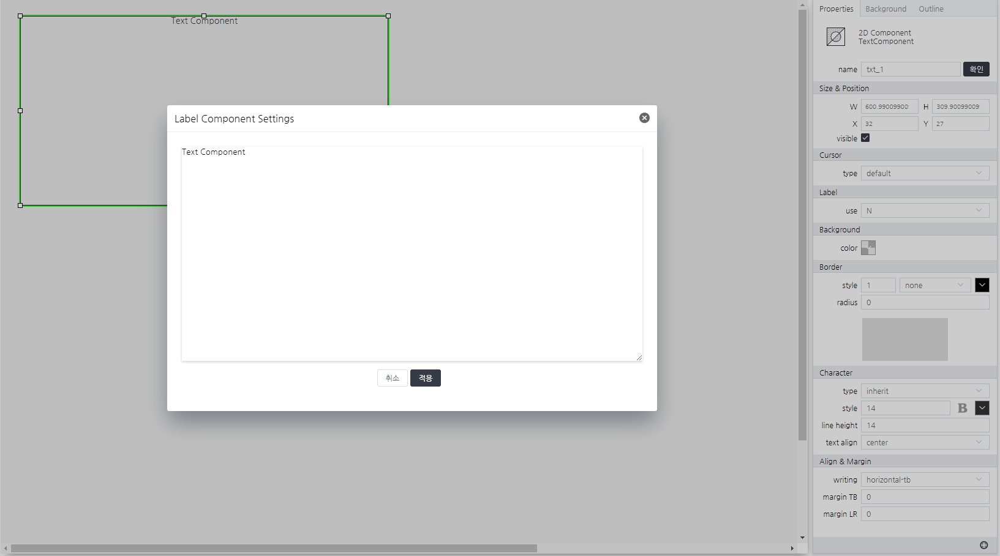

# TextComponent
> 데이터 셋으로 text를 설정할 수 있는 컴포넌트입니다.

#### Properties
| Name       | Type    | Desc                                                |
| :--------- | :------ | :-------------------------------------------------- |
| text | String  | text 정보                                  |

#### Methods

TextComponent는 함수를 제공하지 않습니다.

#### Events
|이벤트명|이벤트 인자|설명|
|---|---|---|
|click||마우스 클릭시 발생|
|dblclick||마우스 더블 클릭시 발생|
|register||화면에 등록시 발생|
|completed||리소스 로드 완료시 발생|
|destroy||컴포넌트 삭제시 발생|
|change|value|값을 선택시 발생|


#### How to use
```js
// 해당 컴포넌트의 속성을 변경하는 방법 01.
this.text = "textComponent test!";
// 해당 컴포넌트의 속성을 변경하는 방법 02.
this.setGroupPropertyValue("setter","value", "sample_text")
// 이벤트 인자 확인 방법
console.log(event.data.value);
```

---


<p align="right" style="margin-top: -.85em;font-style: italic;">Text 프로퍼티 설정 및 에디터 화면</p>