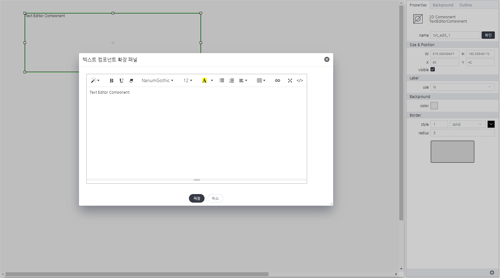

# TextEditorComponent
> text를 라벨링 용도로 사용 할 수 있는 컴포넌트입니다.
> 데이터 셋 바인딩은 textComponent 사용을 권고합니다.

#### Properties

TextEditorComponent는 속성을 제공하지 않습니다.

#### Methods

TextEditorComponent는 함수를 제공하지 않습니다.

#### Events
|이벤트명|이벤트 인자|설명|
|---|---|---|
|click||마우스 클릭시 발생|
|dblclick||마우스 더블 클릭시 발생|
|register||화면에 등록시 발생|
|completed||리소스 로드 완료시 발생|
|destroy||컴포넌트 삭제시 발생|

#### How to use

TextEditorComponent은 컴포넌트의 기본 사용법만 제공합니다.

#### Example

텍스트 에디터 설정화면
