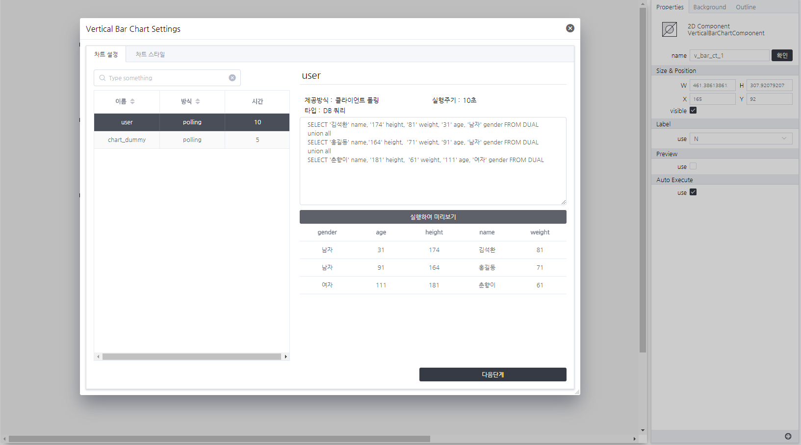
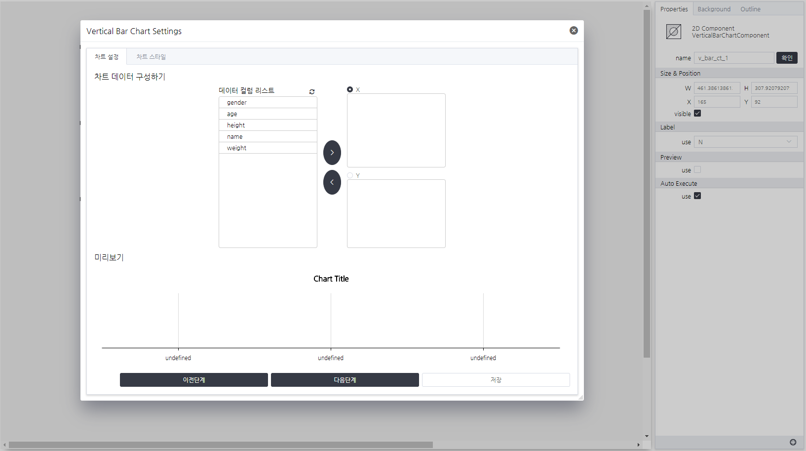
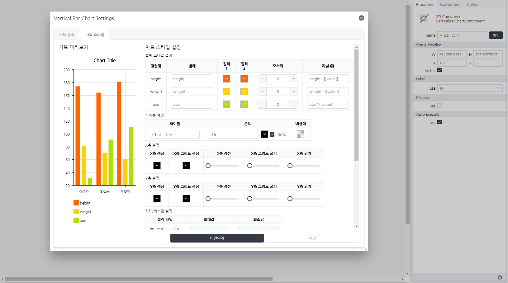

# Chart Pack
> 차트를 구성할 수 있는 컴포넌트 팩

|Component|Description|
|---|---|---|
|Vertical Bar|수직 막대 컴포넌트|
|Horizontal Bar|수평 막대 차트 컴포넌트|
|Line|라인 차트 컴포넌트|
|Pie|파이 차트 컴포넌트|
|Stack Column|스택 컬럼 차트 컴포넌트|
|Stack Bar|스택 바 차트 컴포넌트|
|Area|영역 차트 컴포넌트|
|Column Line|컬럼 라인 차트 컴포넌트|
|Stack Line|스택 라인 차트 컴포넌트|

---

#### Chart Common Methods
<style>
    .method_container {padding:20px; background-color:#fff; box-shadow:0 0 4px rgba(0, 0, 0, 0.25); border:1px solid rgba(0, 0, 0, 0.25);}
    .method_container ul {font-size:12px;}
    .method_access {border-radius:2px; margin-right:5px; background-color:#999999;padding:1px 1px 1px 4px;font-size:11px !important;font-weight:normal;}
    .method_title {font-size:20px;font-weight:bold;margin-bottom:20px;}
    .source_description {font-style:italic; font-size:13px; color:#808080; }
    .source_description p { margin: 0}
    .source_description ul { margin: 0}
    .parameters_title { font-size:15px; font-weight:bold; margin-top:20px;}
    .parameters li { font-weight:bold; }
    .data_type { font-style:italic; font-weight:normal; }
</style>

<div class="method_container">
    <a name="addeventlistener" class="tsd-anchor"></a>
    <div class="method_title">
        <!-- <span class="method_access">
            Protected
        </span> -->
        makeChartData(data: <span class="data_type">Array<`json`></span>): void
    </div>
    <ul style="list-style:none;margin-left:-20px;margin-right:-20px;border:1px solid #eee;padding:10px 10px 10px 40px;font-size:17px;">
        <li>차트 데이터 갱신 함수</li>
    </ul>
    <ul style="list-style:none;">
        <li>
        <div class="parameters_title">Parameters</div>
        <ul class="parameters">
            <li>data: <span class="data_type">Array<`json`></span></li>
        </ul>
        <div class="parameters_title">Returns: <span class="data_type">void</span></div>
        </li>
    </ul>
</div>


    Parameter(Array<`json`>)의 json 형태는 에디터에서 설정되어진 형태이어야만 한다.



#### How to use

```js
// 함수 호출하여 기존 차트의 데이터를 갱신하는 방법
var data = [{"name":"홍길동","age":81,"weight":74,"height":185}]
this.makeChartData(data);

// 이벤트 인자 확인 방법
console.log(event.data.value);
// 결과값(샘플) > [{"name":"홍길동","age":81,"weight":74,"height":185}]
```

---

<p align="right" style="margin-top: -.85em;font-style: italic;">데이터셋 설정 및 미리보기 화면</p>


<p align="right" style="margin-top: -.85em;font-style: italic;">차트 축 설정 및 미리보기 화면</p>


<p align="right" style="margin-top: -.85em;font-style: italic;">차트 스타일 설정화면</p>