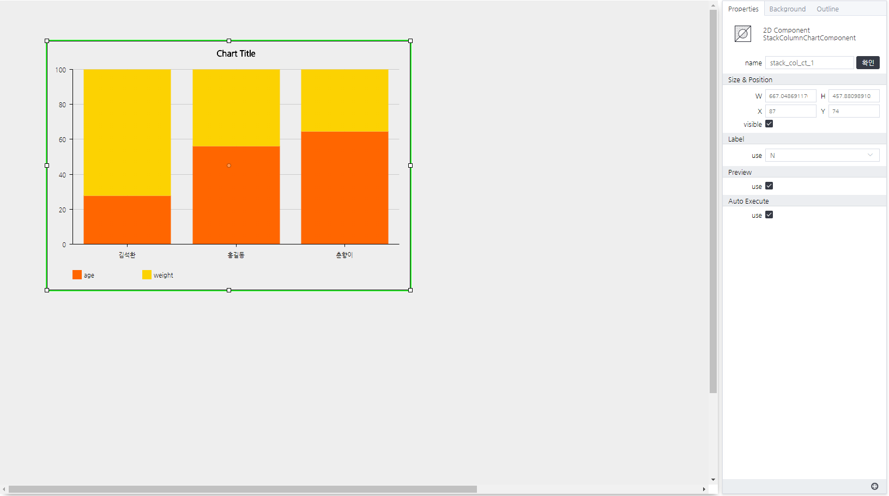

# Stack Column Chart Component
> 스택 컬럼 차트를 그려주는 컴포넌트

#### Properties
Stack Column Chart Component does not provide any properties.

#### Methods
Stack Column Chart Component는 함수를 제공하지 않습니다. 상위 함수만 존재합니다. (Chart Pack 참고)

#### Events
|이벤트명|이벤트 인자|설명|
|---|---|---|
|click||마우스 클릭시 발생|
|dblclick||마우스 더블 클릭시 발생|
|register||화면에 등록시 발생|
|completed||리소스 로드 완료시 발생|
|destroy||화면에 해제시 발생|
|change|value|데이터 변경시 발생|

#### How to use

상위 페이지 Chart Pack의 기본 사용법만 제공합니다.

---

설정된 차트 컴포넌트
