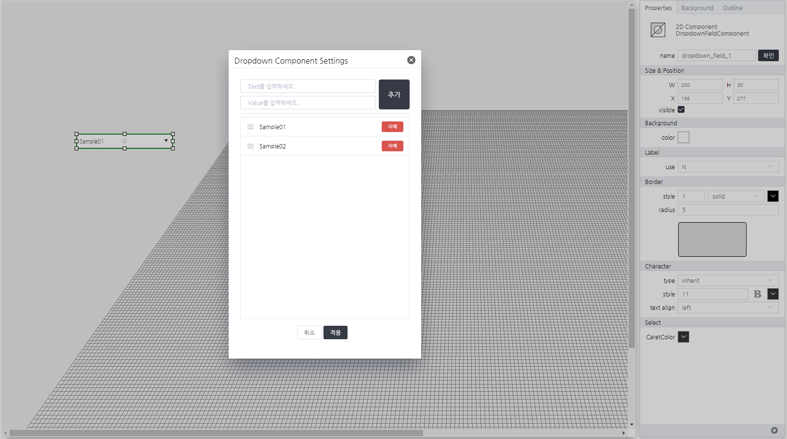

# DropdownFieldComponent
> 사용자 정의 목록을 받아 선택할 수 있는 컴포넌트

#### Properties
| Name       | Type    | Desc                                                |
| :--------- | :------ | :-------------------------------------------------- |
| options | Array<`json`[^1]>  | 옵션 목록                                  |
| value   | String | 선택되어진 옵션 정보                                 |

[^1]: *json*
```json
{
  text: "화면에 표시될 문자열",
  value: "실제 데이터"
}
```

#### Methods

DropdownFieldComponent는 함수를 제공하지 않습니다.

#### Events
|이벤트명|이벤트 인자|설명|
|---|---|---|
|register||화면에 등록시 발생|
|completed||리소스 로드 완료시 발생|
|destroy||화면에 해제시 발생|
|change|value|값을 선택시 발생|


#### How to use
```js
// 해당 컴포넌트의 속성을 변경하는 방법 01
this.options = [{text:"Sample01",value:"sample01"},
                {text:"Sample02",value:"sample02"}];
this.value = "sample02";
// 해당 컴포넌트의 속성을 변경하는 방법 02
this.setGroupPropertyValue("setter","options",[{text:"Sample01",value:"sample01"},{text:"Sample02",value:"sample02"}]);
this.setGroupPropertyValue("setter","value","sample02");
// 이벤트 인자 확인 방법
console.log(event.data.value);
// 결과값(샘플) > sample02
```


---


<p align="right" style="margin-top: -.85em;font-style: italic;">Dropdown 목록 설정 화면</p>