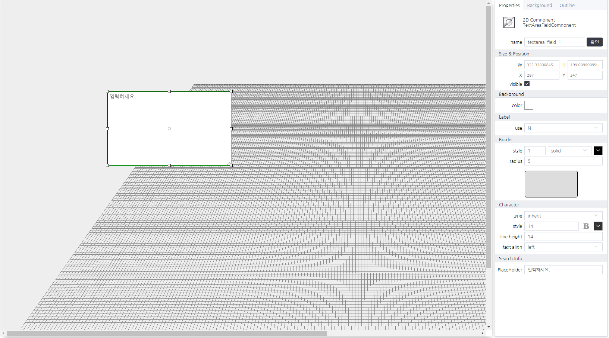

# TextAreaFieldComponent
> 다중열로 사용자 입력을 받는 컴포넌트

#### Properties
| Name       | Type    | Desc                                                |
| :--------- | :------ | :-------------------------------------------------- |
| value   | String | 사용자가 입력한 문자열                                |


#### Methods

TextAreaFieldComponent는 함수를 제공하지 않습니다.


#### Events
|이벤트명|이벤트 인자|설명|
|---|---|---|
|click||마우스 클릭시 발생|
|dblclick||마우스 더블 클릭시 발생|
|register||화면에 등록시 발생|
|completed||리소스 로드 완료시 발생|
|destroy||화면에 해제시 발생|
|change|value|값을 입력시 발생|


#### How to use
```js
// 해당 컴포넌트의 속성을 변경하는 방법 01
this.value = "sample";
// 해당 컴포넌트의 속성을 변경하는 방법 02
this.setGroupPropertyValue("setter","value","sample");
// 이벤트 인자 확인 방법
console.log(event.data.value);
```


#### Example

