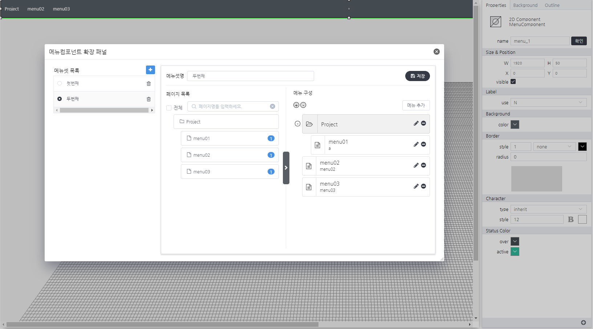

# Basic Menu Component
> MenuSet(Page구성)에 따라 메뉴 네비게이터를 구성하는 컴포넌트

#### Properties
| Name       | Type    | Desc                                                |
| :--------- | :------ | :-------------------------------------------------- |
| menuSetId | String | 저장되어진 메뉴셋의 고유 키값 |
| active_color | RGB | 활성화된 메뉴의 색상 |
| background_hover_color | RGB | 마우스 오버시 표현되는 메뉴 색상 |

#### Methods

BasicMenuComponent는 함수를 제공하지 않습니다.

#### Events

|이벤트명|이벤트 인자|설명|
|---|---|---|
|click||마우스 클릭시 발생|
|dblclick||마우스 더블 클릭시 발생|
|register||화면에 등록시 발생|
|completed||리소스 로드 완료시 발생|
|destroy||화면에 해제시 발생|
|selectMenuItem|`json`[^1]|메뉴 선택시 발생|

[^1]: *selectMenuItem*
```json
{
    type:"link/page",
    isPopup:false,
    url:""
}
```

#### How to use
<!-- js-console -->
```js
// 해당 컴포넌트의 속성을 변경하는 방법01
this.menuSetId = "130741114213-....";
// 해당 컴포넌트의 속성을 변경하는 방법02
this.setGroupPropertyValue("setter","menuSetId","130741114213-....");
```

#### Example

