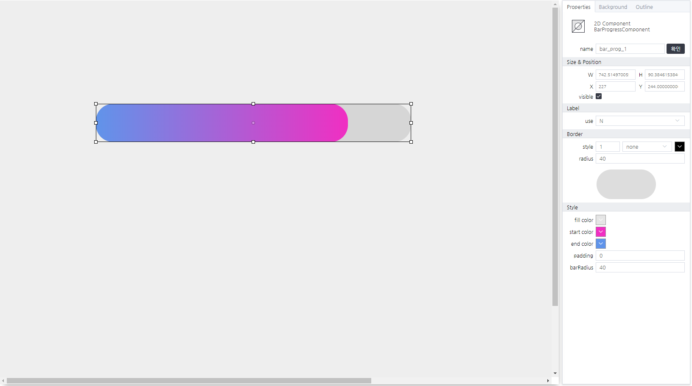

# Bar Progress Component
> 막대 형태의 진척도를 나타내는 컴포넌트

#### Properties
| Name       | Type    | Desc                                                |
| :--------- | :------ | :-------------------------------------------------- |
| value   | Number | 0-100까지의 숫자                                 |

#### Methods
BarProgressComponent는 함수를 제공하지 않습니다.

#### Events
|이벤트명|이벤트 인자|설명|
|---|---|---|
|click||마우스 클릭시 발생|
|dblclick||마우스 더블 클릭시 발생|
|register||화면에 등록시 발생|
|completed||리소스 로드 완료시 발생|
|destroy||화면에 해제시 발생|
|change|value|값을 선택시 발생|

#### How to use
```js
// 해당 컴포넌트의 속성을 변경하는 방법 01
this.value = 50;
// 해당 컴포넌트의 속성을 변경하는 방법 02
this.setGroupPropertyValue("setter","value",50);

// 이벤트 인자 확인 방법
console.log(event.data.value);
// 결과값(샘플) > 50
```


---


<p align="right" style="margin-top: -.85em;font-style: italic;">에디터 설정 화면</p>