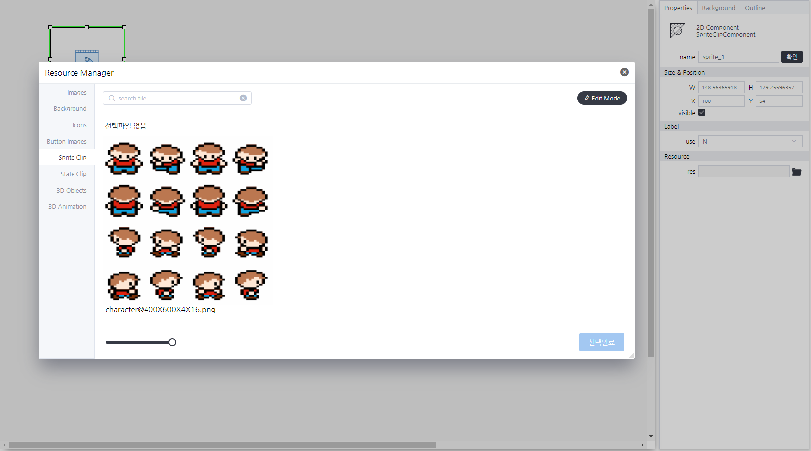

# Basic Sprite Component
> 움직이는 애니메이션을 구성할 수 있는 컴포넌트

#### Properties
| Name | Type | Desc |
| --- | --- | --- |
|selectItem|`json`[^1]|선택되어진 리소스 정보|

[^1]: *selectItem*
```json
{
    "path":"리소스 경로",
    "data": {
        "width":"이미지 넓이",
        "height":"이미지 높이",
        "columns":"리소스 행의 수",
        "totalFrames":"총 프레임의 수"
    }
}
```

#### Methods
Basic Sprite Component는 함수를 제공하지 않습니다.

#### Events
|이벤트명|이벤트 인자|설명|
|---|---|---|
|click||마우스 클릭시 발생|
|dblclick||마우스 더블 클릭시 발생|
|register||화면에 등록시 발생|
|completed||리소스 로드 완료시 발생|
|destroy||화면에 해제시 발생|

#### How to use

SpriteComponent은 컴포넌트의 기본 사용법만 제공합니다.

---


<p align="right" style="margin-top: -.85em;font-style: italic;">Sprite 설정 화면</p>