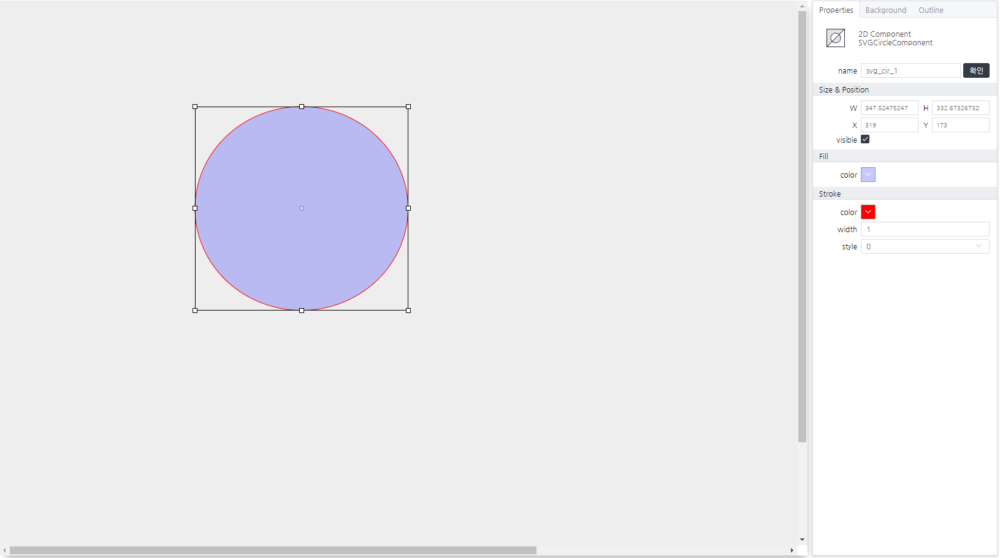

# Curve Component
> 곡선을 그려주는 컴포넌트

#### Properties

Circle Component는 속성을 제공하지 않습니다.

#### Methods

Circle Component는 함수를 제공하지 않습니다.

#### Events
|이벤트명|이벤트 인자|설명|
|---|---|---|
|click||마우스 클릭시 발생|
|dblclick||마우스 더블 클릭시 발생|
|register||화면에 등록시 발생|
|completed||리소스 로드 완료시 발생|
|destroy||화면에 해제시 발생|

#### How to use

상위 페이지 SVG Pack의 기본 사용법만 제공합니다.

---

에디터 설정 화면
