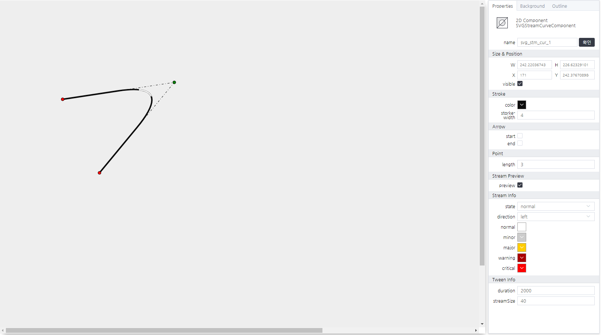

# Stream Curve Component
> 곡선에 흐름을 표현하는 컴포넌트

#### Properties

Stream Broken Component는 속성을 제공하지 않습니다.

#### Methods

<style>
    .method_container {padding:20px; background-color:#fff; box-shadow:0 0 4px rgba(0, 0, 0, 0.25); border:1px solid rgba(0, 0, 0, 0.25);}
    .method_container ul {font-size:12px;}
    .method_access {border-radius:2px; margin-right:5px; background-color:#999999;padding:1px 1px 1px 4px;font-size:11px !important;font-weight:normal;}
    .method_title {font-size:20px;font-weight:bold;margin-bottom:20px;}
    .source_description {font-style:italic; font-size:13px; color:#808080; }
    .source_description p { margin: 0}
    .source_description ul { margin: 0}
    .parameters_title { font-size:15px; font-weight:bold; margin-top:20px;}
    .parameters li { font-weight:bold; }
    .data_type { font-style:italic; font-weight:normal; }
</style>

<div class="method_container">
    <a name="addeventlistener" class="tsd-anchor"></a>
    <div class="method_title">
        play(): void
    </div>
    <ul style="list-style:none;margin-left:-20px;margin-right:-20px;border:1px solid #eee;padding:10px 10px 10px 40px;font-size:17px;">
        <li>선의 흐름을 시작하는 함수</li>
    </ul>
    <ul style="list-style:none;">
        <li>
            <div class="parameters_title">Returns: <span class="data_type">void</span></div>
        </li>
    </ul>
</div>
<br>
<div class="method_container">
    <a name="addeventlistener" class="tsd-anchor"></a>
    <div class="method_title">
        stop(): void
    </div>
    <ul style="list-style:none;margin-left:-20px;margin-right:-20px;border:1px solid #eee;padding:10px 10px 10px 40px;font-size:17px;">
        <li>선의 흐름을 멈추는 함수</li>
    </ul>
    <ul style="list-style:none;">
        <li>
        <div class="parameters_title">Returns: <span class="data_type">void</span></div>
        </li>
    </ul>
</div>

#### Events
|이벤트명|이벤트 인자|설명|
|---|---|---|
|click||마우스 클릭시 발생|
|dblclick||마우스 더블 클릭시 발생|
|register||화면에 등록시 발생|
|completed||리소스 로드 완료시 발생|
|destroy||화면에 해제시 발생|

#### How to use
```js
// stream에 대한 옵션 변경하는 방법.
this.setGroupPropertyValue("tweenInfo","duration",1000); //속도 제어
this.setGroupPropertyValue("tweenInfo","streamSize", 100); //스트림에 대한 크기 제어

// 흐름 시작
this.play();
// 흐름 중지
this.stop();
// 흐름의 옵션을 변경하기 위해서는 항상 중지 후 변경하셔야 적용됩니다.
```


---


<p align="right" style="margin-top: -.85em;font-style: italic;">에디터 설정 화면</p>