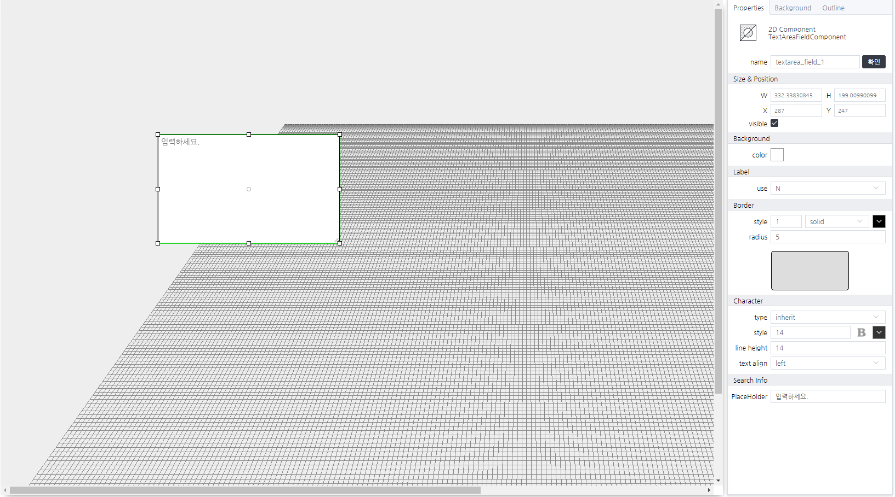

# TextAreaFieldComponent
> FormPack

#### Properties
| Name       | Type    | Desc                                                |
| :--------- | :------ | :-------------------------------------------------- |
| value   | String | 사용자가 입력한 문자열                                |

---
#### Methods

TextAreaFieldComponent does not provide any methods.

---
#### Events
|이벤트명|설명|
|---|---|
|click|마우스 클릭시 발생|
|change[^2]|값을 입력시 발생|

[^2]*change event information*
```json
{
    name: "change",
    label: "값 입력 이벤트",
    description: "값 입력 이벤트 입니다.",
    properties: [{
        name: "value",
        type: "string",
        default: "",
        description: "새로운 값입니다."
    }]
}
```

#### WScript Example
<!-- js-console -->
```js
// SearchFieldComponent의 값을 테스트로 입력하는 예제
this.value = "테스트";
```

---

<p align="right" style="font-style:italic;">화면예시</p>